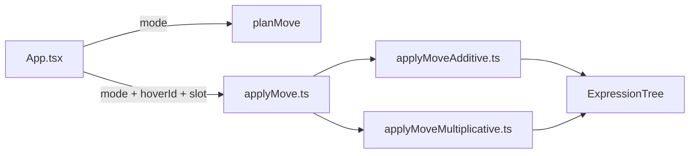

# TDD-first multiplicative moves + integration suite + applyMove split

## Goals

- Add **move mode toggle** (Additive vs Multiplicative) in the UI.
- Implement **multiplicative motion**:
  - Reorder/insert **factors within products** (`InvisibleOperator`/`Multiply`).
  - Across `=` (smart):
    - Drop on side root ⇒ **divide whole side** (e.g. `F = m a` → `1 = \frac{m a}{F}`).
    - Drop inside a product ⇒ insert **reciprocal factor** (`1/F`) at that slot.
- Follow **TDD**: for each new behavior, add a **failing test first**, then implement until it passes.
- Create a **large, table-driven integration test suite**: “create expression → execute intended move → verify expected `latexPlain`”.
- Refactor to avoid a monolithic file: split `applyMove` into additive vs multiplicative executors + split tests.

## Key decision defaults (per your answers)

- Integration tests assert **`tree.latexPlain`** as the primary output.
- `applyMove` split style: **two files + dispatcher**.

## Proposed file/module structure

- **Dispatcher**: [`c:\repos\physics-derivation-pad\src\moveExpression\applyMove.ts`](c:\repos\physics-derivation-pad\src\moveExpression\applyMove.ts)
  - Exports `applyMove({..., mode})` and routes to additive/multiplicative executor.
- **Additive executor**: `src/moveExpression/applyMoveAdditive.ts`
- **Multiplicative executor**: `src/moveExpression/applyMoveMultiplicative.ts`
- **Shared helpers** (optional, only if needed): `src/moveExpression/moveShared.ts`

## Testing strategy (TDD + integration)

### A) Split unit tests by executor

- Rename/split existing tests:
  - Additive tests → `src/moveExpression/applyMoveAdditive.test.ts`
  - New multiplicative unit tests → `src/moveExpression/applyMoveMultiplicative.test.ts`

### B) New integration test file (table-driven)

- Add `src/moveExpression/moveIntegration.test.ts` containing an array of cases:
  - `name`
  - `mode: "additive" | "multiplicative"`
  - `inputLatex`
  - `select`: how to find selected node IDs (use existing helpers like `findNodeByLatex()` / `findNodeId()`)
  - `hover`: how to find hover/target node ID
  - `targetSlot`
  - `expectedLatexPlain`

This will let us rapidly add many regression-style scenarios as we expand semantics.

## Implementation plan (sequenced for TDD)

## 0) Refactor-only step (no behavior change)

- Move current additive logic out of `applyMove.ts` into `applyMoveAdditive.ts`.
- Keep `applyMove.ts` as a thin dispatcher that defaults to additive.
- Split existing tests into `applyMoveAdditive.test.ts` and ensure they still pass.

Note: this is a refactor, so we’ll rely on the existing additive test suite as the safety net (TDD applies to **new behavior additions**).

## 1) Add failing integration test for the flagship multiplicative example

- In `moveIntegration.test.ts`, add a failing test case:
  - **Input**: `F = m a`
  - **Action** (multiplicative): select `F`, drop onto RHS side root
  - **Expected**: `1 = \frac{m a}{F}` (compare via `latexPlain` with whitespace normalized)

## 2) Implement minimal multiplicative cross-equal behavior to pass the test

- Add `applyMoveMultiplicative.ts` with just enough logic to:
  - Replace the moved side with multiplicative identity `1`
  - Rewrite destination side root into `Divide(dest, moved)`
- Wire dispatcher to call multiplicative executor when `mode === "multiplicative"`.

## 3) Expand multiplicative coverage via failing tests (then implement)

- Add failing integration + unit tests for:
  - **Drop inside a product**: destination product gets a `1/F` factor inserted at slot.
  - **Reorder factors** within `InvisibleOperator` / `Multiply`.
  - **Insert factor** into another product container.

## 4) UI toggle + planning support

- Add mode state + toolbar UI in [`src/App.tsx`](c:\repos\physics-derivation-pad\src\App.tsx).
- Extend [`src/planMove.ts`](c:\repos\physics-derivation-pad\src\planMove.ts) to accept `{ mode }` and plan multiplicative container moves.
- Update overlay plumbing in `App.tsx` to render insertion markers for product containers as well.

## 5) Grow the integration suite (regression pack)

- Add a batch of additional cases (10–30+) covering:
  - additive cross-equal (existing behavior)
  - multiplicative cross-equal (root vs inside-product)
  - nested parentheses / negation interaction
  - fractions (numerator insertion constraints, if applicable)

## Data flow

## Implementation todos

- **refactor-applyMove-split**: Extract additive executor + dispatcher, split existing tests to additive file.
- **add-integration-harness**: Add `moveIntegration.test.ts` with table-driven runner helpers.
- **tdd-mul-cross-equal-root**: Add failing integration test for `F = m a` → `1 = (m a)/F`, then implement in multiplicative executor.
- **tdd-mul-in-product**: Add failing tests for reciprocal factor insertion into a product, then implement.
- **tdd-mul-product-reorder-insert**: Add failing tests for factor reorder/insert, then implement.
- **ui-mode-toggle**: Add toolbar mode switch + plumb to `planMove` + `applyMove`.
- **planMove-multiplicative**: Plan multiplicative moves + update overlay mapping.
- **grow-integration-pack**: Add a larger regression matrix of move scenarios.
