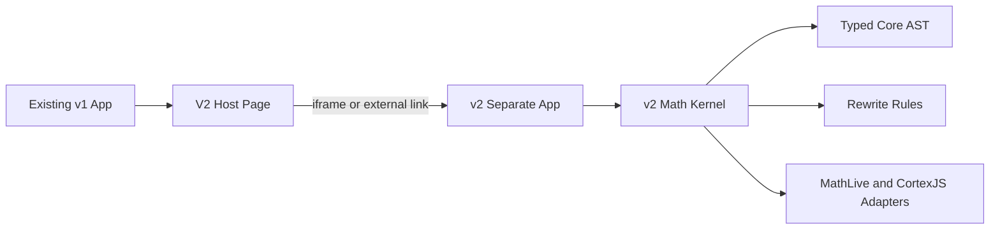

# V2 Rewrite Plan

## Boundary Decision

Create `v2/` as a separate app/package, not a workspace conversion and not shared root dependencies. The current app remains the production/stable v1 surface. The only intentional v1 change is a small integration page that points at v2.

Key existing integration points:

- Current app shell: [`src/App.tsx`](src/App.tsx) uses an in-memory `Page = "debug" | "derivation"` state switch.
- Current entry: [`src/main.tsx`](src/main.tsx) renders only the v1 `App`.
- Current Vite config: [`vite.config.ts`](vite.config.ts) is simple and should not need v2 changes.
- Current dependency baseline: [`package.json`](package.json) remains stable for v1.

## Target Shape



The v1 host page should not import v2 source modules. It should use a configured URL such as `VITE_V2_APP_URL`, defaulting in development to a separate local v2 dev server port. This preserves bundle, dependency, CSS, storage, and runtime isolation.

## Phase 1: Isolated V2 App Scaffold

Create `v2/` as a standalone Vite app with its own `package.json`, `package-lock.json`, `tsconfig`, `vite.config.ts`, `eslint.config`, and test config. Install latest compatible versions at implementation time using npm inside `v2/`, including current React, Vite, TypeScript, Vitest, Playwright as needed, MathLive, and CortexJS/Compute Engine.

Recommended scripts:

- `npm --prefix v2 run dev`
- `npm --prefix v2 run build`
- `npm --prefix v2 run test`
- `npm --prefix v2 run test:e2e`

Optional root aliases can be added later for convenience, but v1 scripts should continue to mean v1 only.

## Phase 2: V1 Host Page For V2

Add a minimal v1 page, likely [`src/pages/V2Page.tsx`](src/pages/V2Page.tsx), and extend [`src/App.tsx`](src/App.tsx) from `"debug" | "derivation"` to include `"v2"`.

The page should either:

- Embed v2 in an iframe using `VITE_V2_APP_URL`, best for isolation.
- Or link/open v2 externally if iframe hosting becomes awkward.

Preferred first implementation: iframe, because it makes “new page uses v2” true while keeping v2 runtime independent.

## Phase 3: V2 Math Kernel

Build the new core under `v2/src/math/` before recreating the full UI. The first deliverable is not feature parity; it is a clean representation and rewrite pipeline.

Suggested folders:

- `v2/src/math/ast/` for typed expression nodes and constructors.
- `v2/src/math/normalize/` for canonical forms.
- `v2/src/math/rules/` for rewrite rules.
- `v2/src/math/adapters/mathjson/` for CortexJS/MathJSON import/export.
- `v2/src/math/adapters/latex/` for LaTeX rendering/parsing boundaries.
- `v2/src/math/selection/` for stable selection IDs and spans.

Core principle: MathJSON is an adapter format, not the internal model.

## Phase 4: Rewrite Candidate Pipeline

Unify preview and execution by making both consume the same `RewriteCandidate` object. Planning should discover candidates; execution should apply the selected candidate if the source tree still matches.

Conceptual shape:

```ts
type RewriteCandidate = {
  ruleId: string;
  label: string;
  before: Expr;
  after: Expr;
  selectionMapping: SelectionMapping;
  preview: PreviewModel;
};
```

This replaces the current v1 split where hover planning lives around [`src/domain/move/planMove.ts`](src/domain/move/planMove.ts) and execution lives around [`src/moveExpression/applyMove.ts`](src/moveExpression/applyMove.ts), [`src/moveExpression/applyMoveAdditive.ts`](src/moveExpression/applyMoveAdditive.ts), and [`src/moveExpression/applyMoveMultiplicative.ts`](src/moveExpression/applyMoveMultiplicative.ts).

## Phase 5: First Vertical Slice

Do one narrow end-to-end v2 workflow before broad feature work:

1. Parse or construct an equation into the v2 AST.
2. Render it visibly in the v2 page.
3. Select a term/factor.
4. Ask the rule engine for valid move candidates.
5. Show preview from the candidate.
6. Execute the same candidate.
7. Verify with unit tests and one e2e smoke test.

Best initial slice: additive and multiplicative movement across equality, because it exercises the core architecture and addresses the most painful v1 duplication.

## Phase 6: Expand Rule Families

Add rule packs incrementally:

- Core arithmetic normalization: signs, zero, one, flattening, grouping.
- Equality movement: additive inverse, multiplicative inverse, fraction-aware movement.
- Display grouping: force/unforce parentheses without changing semantic meaning.
- Factor/expand/cancel rules.
- Differential and derivative nodes as first-class AST concepts.
- Integral rules after differential representation is stable.
- Substitution and apply-to-both-sides.

Each rule pack should include golden tests from [`todo.md`](todo.md), especially cases that currently fail due to round-trip or planner/executor drift.

## Phase 7: Compatibility And Upgrade Strategy

Keep CortexJS behind a v2 adapter layer. The newest package version can be used in `v2/`, but the adapter should normalize package-specific output into stable v2 AST nodes.

For every important node family, create tests for:

- LaTeX to v2 AST.
- v2 AST to LaTeX.
- MathJSON to v2 AST.
- v2 AST to MathJSON only where needed.
- Round-trip invariants that are about v2 semantics, not raw CortexJS array equality.

## Phase 8: Migration Criteria

Do not replace v1 until v2 has proven coverage for the daily workflow. Track readiness with scenario tests rather than line-by-line feature parity.

Suggested milestones:

- V2 can run beside v1 from the app header.
- V2 has isolated dependencies and CI scripts.
- V2 handles the most common derivation movements without planner/executor divergence.
- V2 handles differentials and partial derivatives as atomic concepts where appropriate.
- V2 has regression tests derived from the highest-value `todo.md` failures.
- V1 remains untouched except for the host page and optional script aliases.
