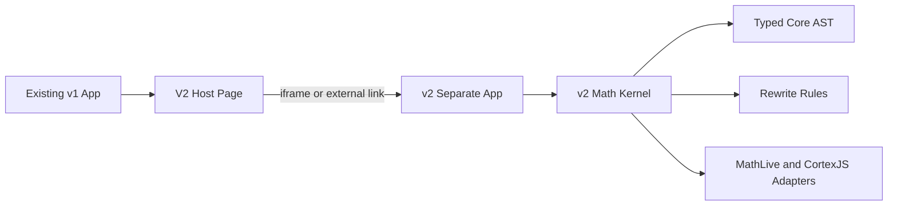

# V2 Rewrite Plan

## Boundary Decision

Create `v2/` as a separate app/package, not a workspace conversion and not shared root dependencies. The current app remains the production/stable v1 surface. The only intentional v1 change is a small integration page that points at v2.

Key existing integration points:

- Current app shell: [`src/App.tsx`](src/App.tsx) uses an in-memory `Page = "debug" | "derivation"` state switch.
- Current entry: [`src/main.tsx`](src/main.tsx) renders only the v1 `App`.
- Current Vite config: [`vite.config.ts`](vite.config.ts) is simple and should not need v2 changes.
- Current dependency baseline: [`package.json`](package.json) remains stable for v1.

## Target Shape



The v1 host page should not import v2 source modules. It should use a configured URL such as `VITE_V2_APP_URL`, defaulting in development to a separate local v2 dev server port. This preserves bundle, dependency, CSS, storage, and runtime isolation.

## Phase 1: Isolated V2 App Scaffold

Create `v2/` as a standalone Vite app with its own `package.json`, `package-lock.json`, `tsconfig`, `vite.config.ts`, `eslint.config`, and test config. Install latest compatible versions at implementation time using npm inside `v2/`, including current React, Vite, TypeScript, Vitest, Playwright, MathLive, and CortexJS/Compute Engine.

Recommended scripts:

- `npm --prefix v2 run dev`
- `npm --prefix v2 run build`
- `npm --prefix v2 run test`
- `npm --prefix v2 run test:e2e`

Optional root aliases can be added later for convenience, but v1 scripts should continue to mean v1 only.

## Phase 2: V1 Host Page For V2

Add a minimal v1 page, likely [`src/pages/V2Page.tsx`](src/pages/V2Page.tsx), and extend [`src/App.tsx`](src/App.tsx) from `"debug" | "derivation"` to include `"v2"`.

The page should either:

- Embed v2 in an iframe using `VITE_V2_APP_URL`, best for isolation.
- Or link/open v2 externally if iframe hosting becomes awkward.

Preferred first implementation: iframe, because it makes “new page uses v2” true while keeping v2 runtime independent.

## Phase 3: Fast Interaction Test Engine

Treat test fidelity as infrastructure, not cleanup. V2 should be able to test the same decisions a user triggers in the browser without requiring a full browser for every case.

Build a v2 test harness with four layers:

- Fast kernel tests in Vitest for AST, normalization, rules, parser adapters, and invariant checks.
- A one-time/browser-assisted geometry fixture generator that renders an expression and records node rectangles.
- A fast deterministic interaction simulator for pointer movement, drag/drop, hover planning, insert indicator placement, and candidate selection using those fixtures.
- Sparse Playwright calibration tests for rendered MathLive/DOM output and browser behavior that the simulator approximates.

The deterministic interaction simulator should be the primary regression engine. It should run hundreds of cases quickly without launching a browser per case.

For each interaction regression case, the normal flow should be:

1. Define the equation, relevant selections, and intended pointer path.
2. Generate or refresh a geometry fixture once by rendering the expression in Playwright and recording the node rectangles, baselines, slots, and selectable spans.
3. Commit that fixture as test data.
4. Run the regular test suite against the committed fixture, simulating mouse movement and hit testing without a browser.

This makes the expensive browser step opt-in and fixture-oriented, not part of every test run.

The simulator should model:

- A rendered expression as a fixture-backed layout tree with node IDs, bounding boxes, baselines, slots, and selectable spans.
- Pointer paths as explicit coordinate sequences: mouse down, movement samples, hover target updates, insert indicator decisions, mouse up.
- The same geometry functions used by the app for hit testing, y-gates, midpoint slots, additive/multiplicative drop kinds, and drag thresholds.
- Expected overlays and insert indicators as data, not screenshots.
- The final `RewriteCandidate` selected by the interaction.

Suggested fixture shape:

```ts
type InteractionFixture = {
  equationLatex: string;
  renderedLatex: string;
  viewport: { width: number; height: number };
  nodes: Array<{
    id: string;
    role: "node" | "slot" | "span";
    latex: string;
    rect: { x: number; y: number; width: number; height: number };
    baseline?: number;
  }>;
};
```

The simulator should expose test helpers for:

- Loading an equation fixture generated from the same rendered output a user sees.
- Querying fixture-backed selectable nodes and their bounding boxes.
- Moving the mouse along explicit coordinate paths, not only firing synthetic semantic events.
- Asserting which insert indicator is visible, where it is anchored, and which rule candidate it represents.
- Capturing the resulting LaTeX/render model after an operation, not just internal state.

The Playwright layer should have two jobs:

- Generate geometry fixtures on demand when a new expression test case is added or an intentional rendering change occurs.
- Run a small calibration and smoke-test suite, not the bulk regression engine.

Its calibration job is to verify that real MathLive/browser layout still agrees with the simulator for representative cases:

- A small set of equations covering sums, products, fractions, parentheses, derivatives, differentials, integrals, and nested expressions.
- Fresh browser-produced bounding boxes compared against committed fixture snapshots within documented tolerances.
- A few real drag paths per interaction family to ensure event sequencing and visible overlays match expectations.

This phase exists because the current v1 tests can pass while the real UI fails, but a browser-only suite would be too slow for hundreds of scenarios. V2 should make interaction behavior testable as pure data, then use Playwright to keep that model honest.

## Phase 4: V2 Math Kernel

Build the new core under `v2/src/math/` before recreating the full UI. The first deliverable is not feature parity; it is a clean representation and rewrite pipeline.

Suggested folders:

- `v2/src/math/ast/` for typed expression nodes and constructors.
- `v2/src/math/normalize/` for canonical forms.
- `v2/src/math/rules/` for rewrite rules.
- `v2/src/math/adapters/mathjson/` for CortexJS/MathJSON import/export.
- `v2/src/math/adapters/latex/` for LaTeX rendering/parsing boundaries.
- `v2/src/math/selection/` for stable selection IDs and spans.

Core principle: MathJSON is an adapter format, not the internal model.

## Phase 5: Rewrite Candidate Pipeline

Unify preview and execution by making both consume the same `RewriteCandidate` object. Planning should discover candidates; execution should apply the selected candidate if the source tree still matches.

Conceptual shape:

```ts
type RewriteCandidate = {
  ruleId: string;
  label: string;
  before: Expr;
  after: Expr;
  selectionMapping: SelectionMapping;
  preview: PreviewModel;
};
```

This replaces the current v1 split where hover planning lives around [`src/domain/move/planMove.ts`](src/domain/move/planMove.ts) and execution lives around [`src/moveExpression/applyMove.ts`](src/moveExpression/applyMove.ts), [`src/moveExpression/applyMoveAdditive.ts`](src/moveExpression/applyMoveAdditive.ts), and [`src/moveExpression/applyMoveMultiplicative.ts`](src/moveExpression/applyMoveMultiplicative.ts).

## Phase 6: LaTeX Commit And Round-Trip Invariants

Every v2 operation should have an explicit commit pipeline. A rule may produce an AST, but the accepted application state should be validated through the same representation that persistence/restoration will use.

Recommended commit flow:


The conservative default should be: render the proposed result to LaTeX, parse that LaTeX back through the v2 parser, validate semantic equivalence against the proposed AST, and commit the reparsed AST as the durable state. This makes persisted/restored behavior match what the app will actually reconstruct.

If any future operation needs to preserve display metadata that cannot be reconstructed from LaTeX, store that metadata separately and make it explicit. Do not silently depend on an internal tree shape that cannot survive persistence.

Validation should distinguish:

- Semantic equivalence: the math meaning matches.
- Display equivalence: required parentheses, brackets, differentials, derivative notation, and insert-target grouping survive rendering.
- Selection mapping: the post-operation selection points at the intended reparsed node/span.

## Phase 7: First Vertical Slice

Do one narrow end-to-end v2 workflow before broad feature work:

1. Parse or construct an equation into the v2 AST.
2. Render it visibly in the v2 page.
3. Select a term/factor.
4. Ask the rule engine for valid move candidates.
5. Show preview from the candidate.
6. Execute the same candidate.
7. Commit through the LaTeX reparse/validate pipeline.
8. Verify with kernel tests plus deterministic interaction tests for pointer movement, insert indicator placement, and restored state.
9. Add one representative Playwright calibration test for the same workflow.

Best initial slice: additive and multiplicative movement across equality, because it exercises the core architecture and addresses the most painful v1 duplication.

## Phase 8: Expand Rule Families

Add rule packs incrementally:

- Core arithmetic normalization: signs, zero, one, flattening, grouping.
- Equality movement: additive inverse, multiplicative inverse, fraction-aware movement.
- Display grouping: force/unforce parentheses without changing semantic meaning.
- Factor/expand/cancel rules.
- Differential and derivative nodes as first-class AST concepts.
- Integral rules after differential representation is stable.
- Substitution and apply-to-both-sides.

Each rule pack should include golden tests from [`todo.md`](todo.md), especially cases that currently fail due to round-trip or planner/executor drift.

## Phase 9: Compatibility And Upgrade Strategy

Keep CortexJS behind a v2 adapter layer. The newest package version can be used in `v2/`, but the adapter should normalize package-specific output into stable v2 AST nodes.

For every important node family, create tests for:

- LaTeX to v2 AST.
- v2 AST to LaTeX.
- MathJSON to v2 AST.
- v2 AST to MathJSON only where needed.
- Round-trip invariants that are about v2 semantics, not raw CortexJS array equality.
- Deterministic interaction tests for cases where geometry, visual grouping, or insert indicators matter.
- Sparse Playwright calibration tests that compare simulator assumptions against real browser layout and event behavior.

## Phase 10: Migration Criteria

Do not replace v1 until v2 has proven coverage for the daily workflow. Track readiness with scenario tests rather than line-by-line feature parity.

Suggested milestones:

- V2 can run beside v1 from the app header.
- V2 has isolated dependencies and CI scripts.
- V2 has a fast deterministic interaction test engine for mouse movement, insert indicators, and rendered layout decisions.
- V2 has sparse Playwright calibration tests proving the deterministic engine matches browser behavior for representative cases.
- V2 commits operation results through LaTeX reparse/validation so persisted and restored state match active state.
- V2 handles the most common derivation movements without planner/executor divergence.
- V2 handles differentials and partial derivatives as atomic concepts where appropriate.
- V2 has regression tests derived from the highest-value `todo.md` failures.
- V1 remains untouched except for the host page and optional script aliases.
