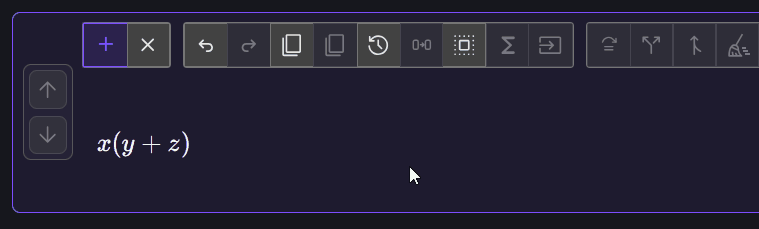

# Distribute and factor

Distribution and factoring are inverse structural rewrites. This tutorial
starts with a product, expands it, and then restores the common factor.

**Prerequisite:** know how to double-click or marquee-select an expression.

## Distribute a product

Enter:

$$
x(y+z)
$$

1. Select the complete product by double-clicking \(x\), or marquee-drag around
   the expression.
2. Click  **Distribute
   selection**, or press <kbd>D</kbd>.

Equation Forge applies \(x\) to each term:

$$
x(y+z)\longrightarrow xy+xz
$$

The action is enabled only when the selected structure matches a supported
distribution rule. Selecting only \(x\) or only \(y+z\) is not enough for this
rewrite.

## Factor the result

With \(xy+xz\) displayed:

1. Marquee-drag around both terms to select the complete sum.
2. Click  **Factor
   selection**, or press <kbd>F</kbd>.

The common factor is extracted:

$$
xy+xz\longrightarrow x(y+z)
$$

If automatic factoring does not choose the intended supported factor, the
 **Force factor
selection** dialog can request a specific nonzero simple rational factor.

## Distinguish factoring from cleanup

Factoring changes the expression's form. By contrast,
 **Clean up
selection** performs supported local numeric and rational simplifications.
Equation Forge keeps these actions separate so that a derivation does not
silently perform extra algebra.

## What to notice

- Toolbar actions operate on the exact structural selection.
- A disabled button means the selected expression does not match that rewrite.
- Distribution and factoring preserve equivalence but expose different useful
  forms.

Continue to [Substitution](substitution.md), or see the
[automatic rewrite reference](../rewrite-features.md#automatic-rewrites).
