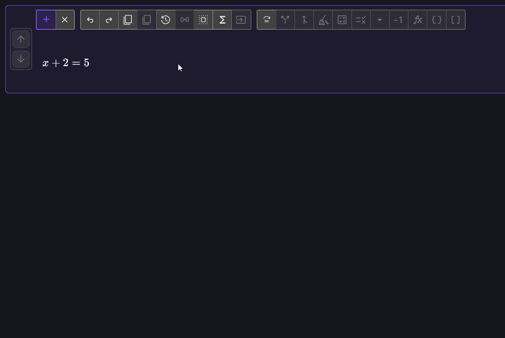
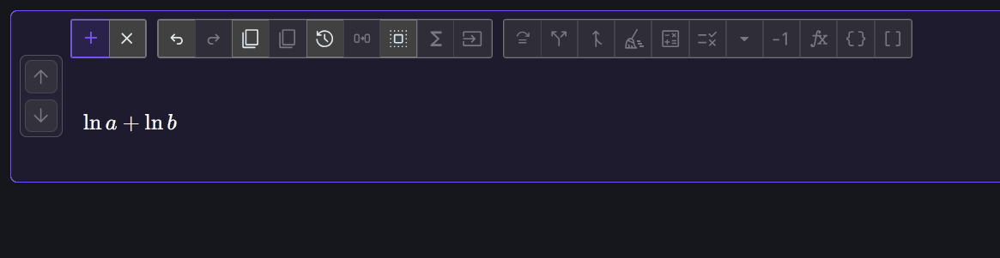
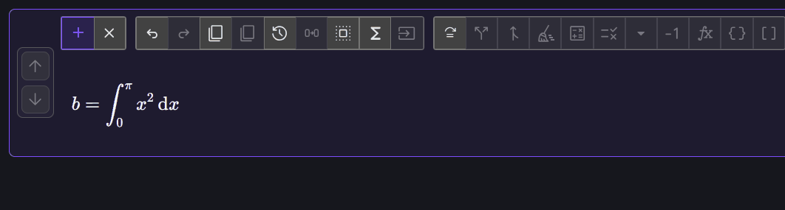

# Operations, identities, and evaluation

Drag moves are intentionally local. For larger transformations, Equation Forge
also provides parameterized operations, named identities, and backend-assisted
evaluation.

## Apply an operation to both sides

Enter:

$$
x+2=5
$$

1. Click  **Apply
   operation**.
2. In the dialog, use `\eqn` as the placeholder for each side and enter the
   template `c\eqn`.
3. Confirm the operation.

The template is applied independently to both sides:

$$
c(x+2)=c(5)
$$

This action records the operation without automatically distributing \(c\) or
cleaning up either side. You can perform those rewrites explicitly afterward.

For inequalities, decide whether the operation reverses the ordering and use
the dialog's inequality-flip option when required. Equation Forge cannot infer
all domain and monotonicity conditions.

## Apply a named identity

Enter:

$$
\ln a+\ln b
$$

Select the complete sum. Click  **Apply identity**, or press
<kbd>T</kbd>, to use the default applicable identity:

$$
\ln a+\ln b\longrightarrow\ln(ab)
$$

If more than one identity applies, open
 **Choose identity** and
select the intended result. Read any displayed caveat: logarithm and power
identities can depend on positivity, reality, or branch assumptions.

## Evaluate a supported integral

Enter:

$$
b=\int_0^\pi x^2\,\mathrm{d}x
$$

Select the integral, then click  **Evaluate selection**.
For this supported input, the bundled Algebrite adapter returns:

$$
b=\frac{1}{3}\pi^3
$$

Evaluation is not a universal solve command. The button is enabled only when
the selected AST can be translated to the backend, and some symbolic results
may still need explicit cleanup.

## What to notice

- Apply operation uses a template and preserves the requested step visibly.
- Identity rewrites are deterministic algebraic rules with possible
  assumptions.
- Evaluate delegates a compatible selection to a computer algebra backend.
- All three actions operate on the current row or structural selection rather
  than silently transforming the whole pad.

Continue to the worked
[enthalpy derivation](enthalpy-from-equation-of-state.md), or consult the
[rewrite reference](../rewrite-features.md).
