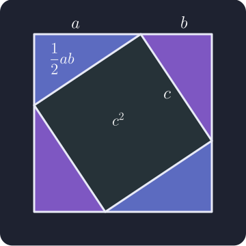

# Worked derivation: the Pythagorean theorem

This short geometric proof begins with four congruent right triangles. Each
triangle has legs \(a\) and \(b\), hypotenuse \(c\), and area
\(\frac{1}{2}ab\).

Arrange the triangles inside a square of side \(a+b\). Their hypotenuses form
a central square of side \(c\):

We will equate the area of the outer square with the areas of its five pieces,
then use Equation Forge to derive:

$$
a^2+b^2=c^2
$$

## 1. Enter the area equation

The outer square has area \((a+b)^2\). The four triangles and central square
have total area \(4\left(\frac{1}{2}ab\right)+c^2\). Add an equation row and
enter:

$$
(a+b)^2=4\left(\frac{1}{2}ab\right)+c^2
$$

This geometric area equation is the premise of the derivation. Equation Forge
will handle the algebra that follows.

## 2. Simplify the triangle area

Select \(4\left(\frac{1}{2}ab\right)\) on the right-hand side and click
 **Clean up
selection**, or press <kbd>C</kbd>:

$$
(a+b)^2=2ab+c^2
$$

## 3. Expand the outer square

Select \((a+b)^2\), click
 **Apply identity**, and
choose **expand-binomial-square**:

$$
a^2+b^2+2ab=2ab+c^2
$$

## 4. Cancel the matching triangle terms

Make sure 
**Additive move mode** is active. Drag \(2ab\) from the right-hand side to the
left and drop it after the other \(2ab\):

$$
a^2+b^2+2ab-2ab=c^2
$$

Select the left-hand side and click
 **Clean up
selection**:

$$
a^2+b^2=c^2
$$

The two copies of \(2ab\) cancel because they represent the same four triangle
areas counted on both sides of the original area equation.

## What this derivation demonstrates

- A geometric argument can provide the starting equation for a symbolic
  derivation.
- Cleanup combines numerical factors and cancels additive inverses.
- A named identity expands a binomial square.
- Additive dragging performs the same operation on opposite sides of an
  equation.
