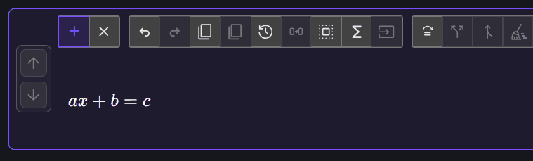
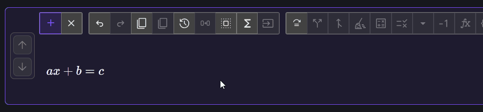
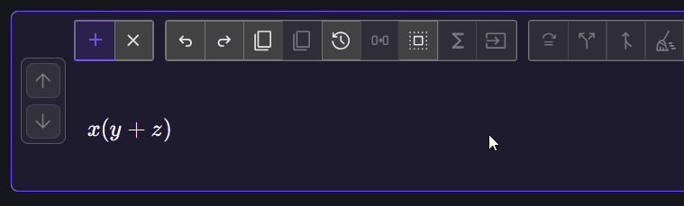

# Selection and rearranging

This tutorial shows how to select expression structure, move several factors
as one term, and rearrange terms without changing their signs.

**Prerequisite:** complete [Your first derivation](../tutorial.md).

## Select one expression

Enter:

$$
ax+b=c
$$

In display mode:

1. double-click \(a\) or \(x\) to select the enclosing product \(ax\);
2. Confirm that the complete product \(ax\) is highlighted.
3. Drag the selection to the right-hand side and release at the insertion
   preview.
4. click empty space to clear the selection.

A selection follows the expression tree. Double-clicking expands from a small
node to a meaningful enclosing expression; it does not select a range of
rendered characters.

## Select several factors with a marquee

To move \(ax\) as one additive term:

1. Make sure  **Additive move mode** is
   active.
2. Press in empty space near \(a\), then marquee-drag across both \(a\) and
   \(x\).

The result is:

$$
b=c-ax
$$

The marquee creates a structural multi-selection. Equation Forge accepts it
only when the enclosed nodes form a supported group, such as adjacent factors
or terms.

## Rearrange terms in place

Enter:

$$
x(y+z)
$$

Keep additive mode active, select \(y\), and drag it to the position after
\(z\). Release when the insertion preview appears:

$$
x(y+z)\longrightarrow x(z+y)
$$

This move changes order but does not move a term across a relation, so the sign
of \(y\) does not change.

Continue to [Distribute and factor](distribute-and-factor.md).
