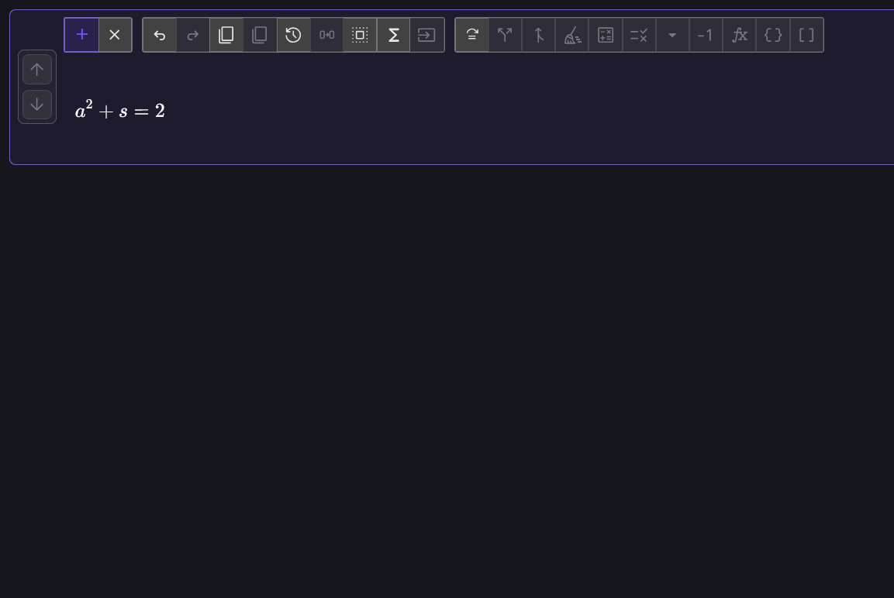
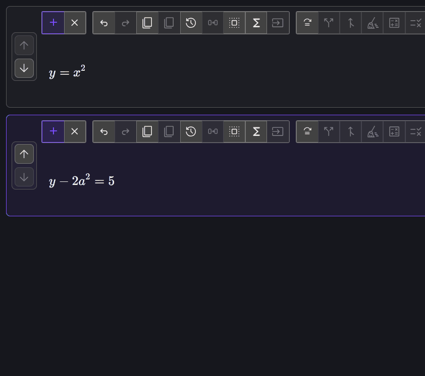

# Substitution

Substitution replaces a selected expression while preserving its surrounding
structure. The replacement can come from another equation in the pad or be
entered directly.

## Enter a replacement expression

Enter:

$$
E = K + m g
$$

Select \(K\), open 
**Substitute**, and enter:

$$
\frac{1}{2} m v^2
$$

After confirmation:

$$
E = \frac{1}{2} m v^2 + m g
$$

The replacement must be an expression, not a complete equality or inequality.
Required parentheses are inserted when the replacement's position needs
grouping.

## Substitute from another equation

Create two equation rows:

$$
y=x^2
$$

and:

$$
y-2a^2=5
$$

Activate the second row, then:

1. Click \(y\) to select it.
2. Click  **Substitute**, or press
   <kbd>S</kbd>.
3. Choose the suggestion supplied by \(y=x^2\).
4. Confirm the replacement.

The second equation becomes:

$$
x^2-2a^2=5
$$

Equation Forge searches other pad rows for relations that can replace the
selection. Notice that the term to be replaced has to be the sole term on the left-hand side of another equation. If it were reversed, like, $x^2 = y$, this will not be recognized.

## Replace every match

 **Substitute all matching
expressions** opens a dialog listing the replaceable symbols in the active
equation. Choose a replacement for one or more listed symbols, then confirm to
apply those replacements to every matching occurrence. This action does not
depend on the current selection.

Use this deliberately: two visually identical symbols can represent different
physical quantities in different contexts, and Equation Forge does not infer
that distinction.

## What to notice

- The selection identifies exactly what will be replaced.
- Existing pad relations provide reusable substitution rules.
- Direct entry can introduce a more complex expression into an existing
  derivation.
- Substitution changes the active equation only; it does not mutate the source
  relation.

Next, try [Operations, identities, and evaluation](operations-identities-and-evaluation.md)
