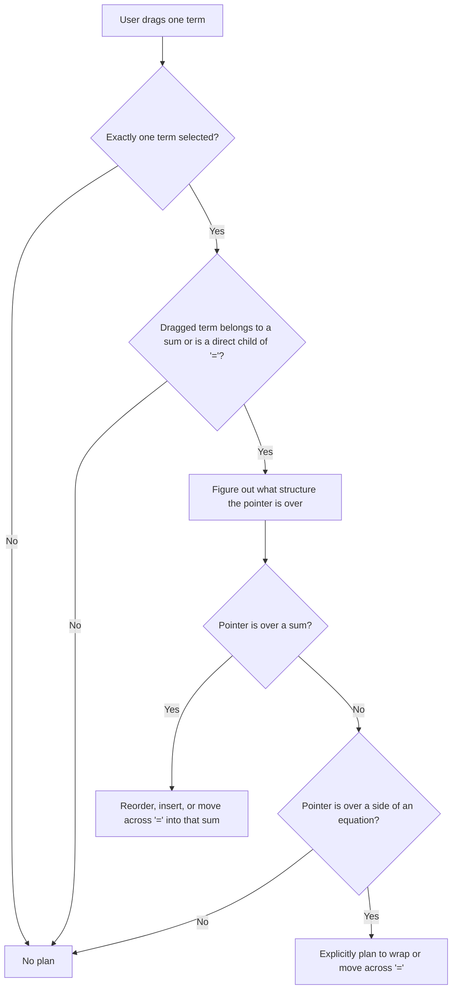

# How `planMove` Decides What a Drag Means

## What problem are we solving?

When a user drags part of a mathematical expression, **the hardest problem is not how to modify the tree** — it’s deciding **what the user intends**.

Examples:

- Are they reordering terms in a sum?
- Are they moving a term to the other side of an equation?
- Are they trying to *create* a new sum on a side that currently isn’t one?
- Did they actually drop somewhere meaningful, or just near something?

Historically, this intent was inferred implicitly across:
- UI code
- geometry logic
- tree mutation logic

That led to bugs like accidental creation of `0 + a`, hovering the equals sign selecting the wrong side, duplicated logic, and brittle fixes.

**`planMove` exists to separate intent from execution.**

Its job is to answer one question:

> Given what the user selected, where the pointer is, and what the expression looks like — what does the user mean to do?

`planMove` does **not** mutate the tree.  
It produces a **MovePlan** or `null`.

---

## What information does `planMove` use?

Conceptually, the planner is given:

1. The current expression tree
2. Exactly one selected term
3. The raw thing the pointer is hovering over (often misleading)
4. The pointer position
5. A way to ask where expressions are drawn on screen

No UI state. No mutation logic.

---

## High-level decision process



---

## Core rules encoded by tests

### Single-selection only

If the user has selected anything other than exactly one term, no plan is produced.

---

### Two broad classes of supported intent

At present, `planMove` understands **two categories of user intent**:

1. **Additive structure manipulation**
   - Reordering terms inside a sum
   - Moving a term between sums
   - Creating a sum where none existed (by wrapping)

2. **Cross-equality moves**
   - Moving a *top-level* term from one side of an equation to the other

The planner distinguishes these *by structure*, not by algebra.

---

### Additive moves: where the dragged term comes from a sum

For additive manipulation, the dragged term must be a **direct child of an `Add` node**.

This allows:
- reordering within the same sum
- inserting into a different sum
- wrapping a non-sum side into a sum and inserting

Dragging a term that is not part of a sum will *not* produce an additive plan.

---

### Cross-equality moves: where the dragged term is a direct child of `=`

If the dragged term is a **direct child of an `Equal` node**, `planMove` may produce a `MoveAcrossEqual` plan.

This expresses the intent:

> “Move this term to the other side of the equation.”

`planMove` does **not** decide what algebraic inverse is used (`-`, `/`, etc.) — that is handled later by `applyMove`.

---

## Hover targets are normalized

The DOM hit-test may say the pointer is over a symbol, a nested subexpression, or the equals sign.

The planner instead asks:

> Which algebraic structure visually contains the pointer?

---

### Deep hover still targets the enclosing structure

Hovering over a nested subexpression still counts as hovering the enclosing sum or equation side if the pointer lies within that structure’s visual band.

---

### Nested sums choose the closest containing sum

When sums are nested, the planner chooses the *closest* sum whose rectangle contains the pointer.

---

### Vertical alignment matters

For any operation involving a sum, the pointer must lie within the vertical band of that sum.

---

## How drop position is determined (important!)

When dropping **into a sum**, the planner computes a *slot* using the **midpoints of the sum’s children**:

- Slot `0` = before the first term
- Slot `1` = between the first and second term
- …
- Slot `n` = after the last term

### Geometry dependency

This means:

- **Child rectangles must be available** for meaningful slot computation.
- If child rectangles are missing, the planner conservatively treats the drop as “append to the end”.

This applies to:
- reordering within a sum
- inserting into a different sum
- dropping into a sum as part of a cross-equality move

This is why tests that assert a specific `toIndex` must provide rects for the sum’s children.

---

## Reordering within a sum

If the pointer is over the same sum the term came from, the intent is reordering.

The planner:
1. Computes a slot based on geometry
2. Adjusts indices to account for removing the dragged term first
3. Returns `null` if the term would not move

---

## Moving between sums

Dragging from one sum and dropping into a different sum yields an explicit “insert into sum” plan.

Structural safety checks prevent inserting into illegal or recursive locations.

---

## The equals sign is not the target

Hovering the equals sign is common but rarely meaningful.

The planner:
- Chooses a side of the equation using rectangle containment when possible
- Falls back to midpoint heuristics only when geometry is complete
- Returns `null` if geometry is insufficient to decide safely

---

## Explicit creation of sums

When a term is dropped onto a side of an equation that is *not* a sum, the planner produces an explicit plan to wrap that side into a sum.

This avoids implicit hacks like creating `0 + a`.

---

## Cross-equality moves in more detail

For an expression like:

```
a + b = c
```

Dragging `c` to the left produces a `MoveAcrossEqual` plan with:

- the source side (`rhs`)
- the destination side (`lhs`)
- *where* on the destination side the term was dropped

The fact that execution involves:
- inserting a `0`
- negating the moved term

is **not part of the plan** — only the intent is.

---

## Confidence gating

Plans that structurally change the tree are only produced when geometry indicates the pointer is actually over the intended target.

If confidence is low, the planner returns `null`.

---

## What `planMove` does not do

- It does not mutate the tree
- It does not perform algebraic simplification
- It does not guess intent when geometry is ambiguous

---

## Why this architecture matters

By centralizing intent:

- UI logic becomes simpler
- Tree mutation code becomes predictable
- Bugs are localized to planner rules
- New behaviors are added by writing tests that describe intent

> If something surprising happens, it should be because the planner explicitly allowed it — not because something implicit happened during mutation.
